# **SocialShare 📱**

**SocialShare** is a cutting-edge Android application designed to revolutionize the way users share and connect on social platforms. From sharing photos and reels to building meaningful connections, **SocialShare** combines innovation with simplicity to deliver a seamless social networking experience.

Built with **Kotlin**, powered by **Firebase**, and enhanced with libraries like **Picasso** and **Glide**, this app exemplifies modern Android development practices. With a vibrant design and tools like **Material3**, **ViewPager**, **CardView**, and **Navigation Drawer**, it ensures a delightful user experience.

---

## 🎥 **App Demo**
👉 **Experience SocialShare in action:**  

<a href="https://youtube.com/shorts/ibQ-xZ2YLx0?feature=share">
  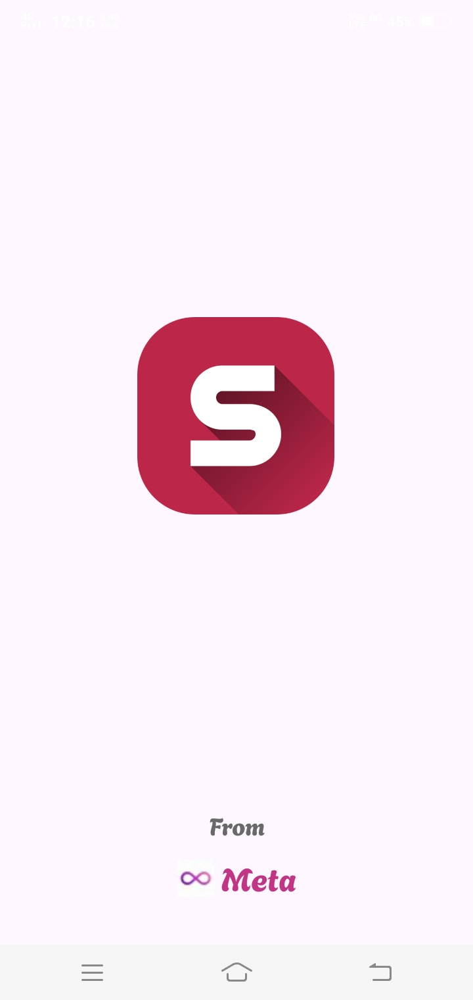
</a>

---

📦 **APK Download**  
[Download SocialShare APK](https://github.com/Vanshi17/SocialShare/raw/main/Screenshots/SocialShare.apk)

---

## 📸 **Screenshots**

  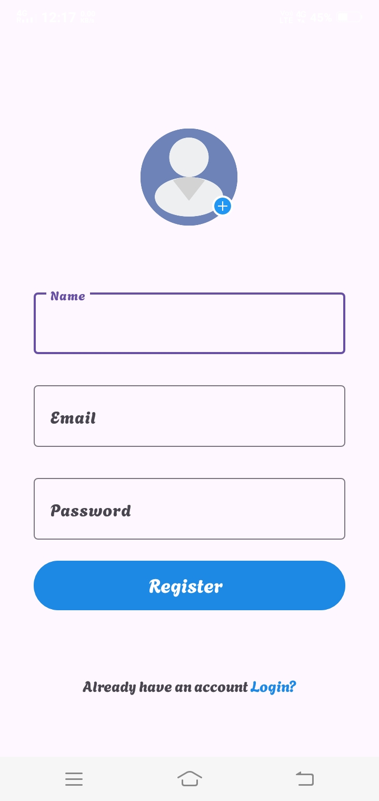  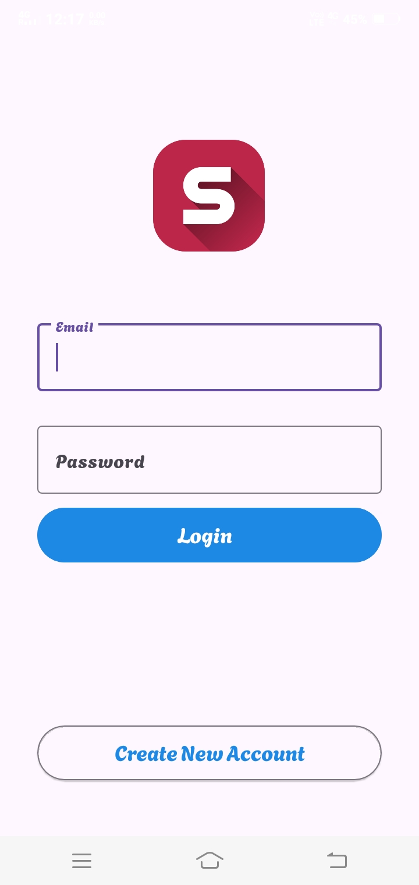  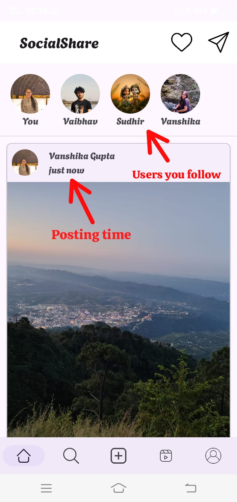  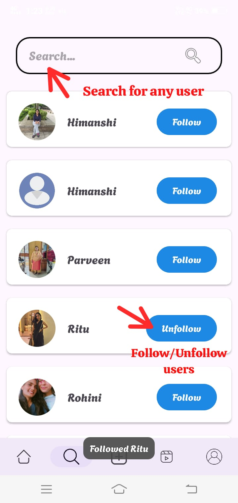  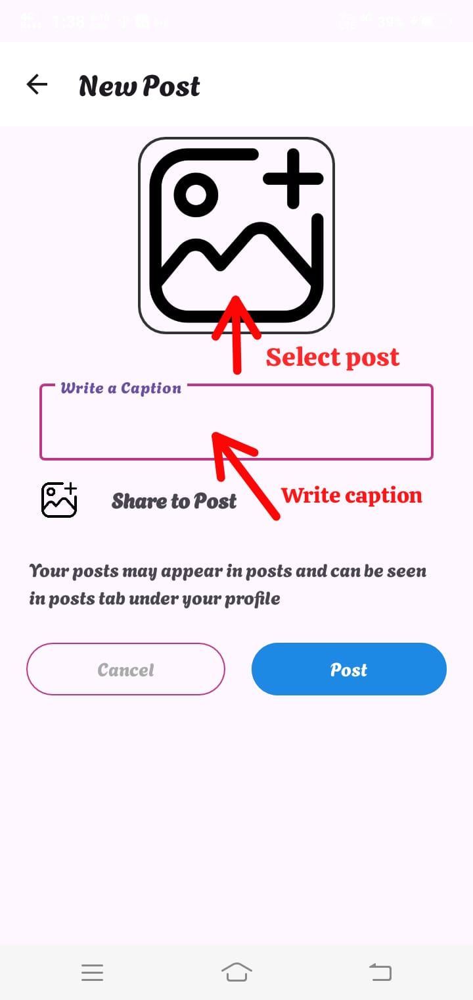  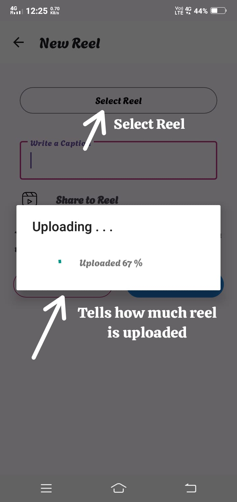  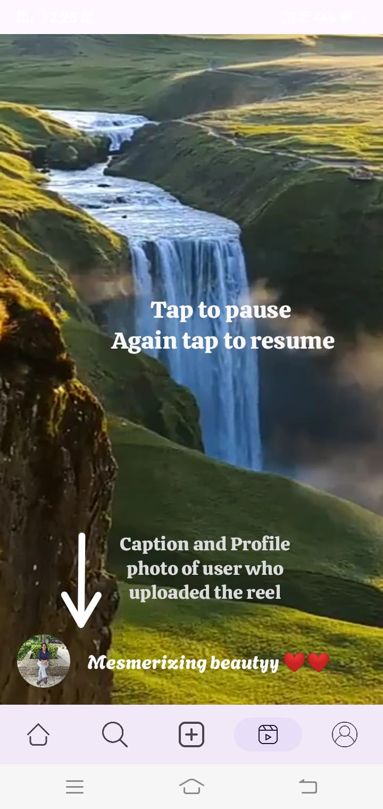  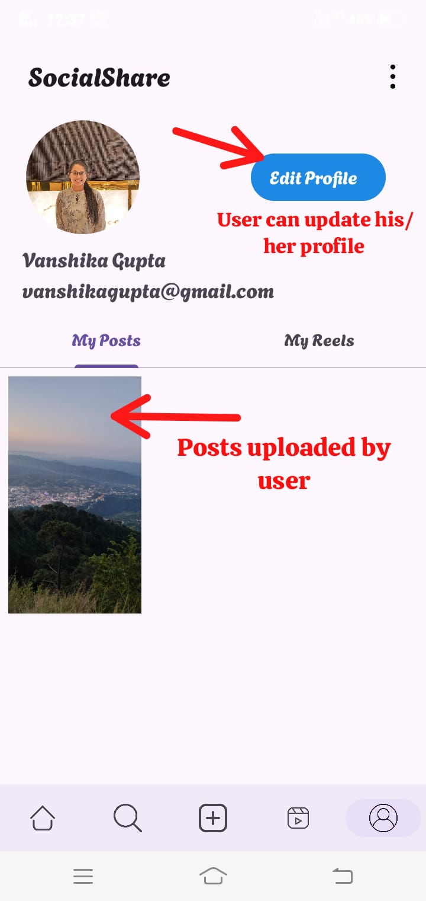  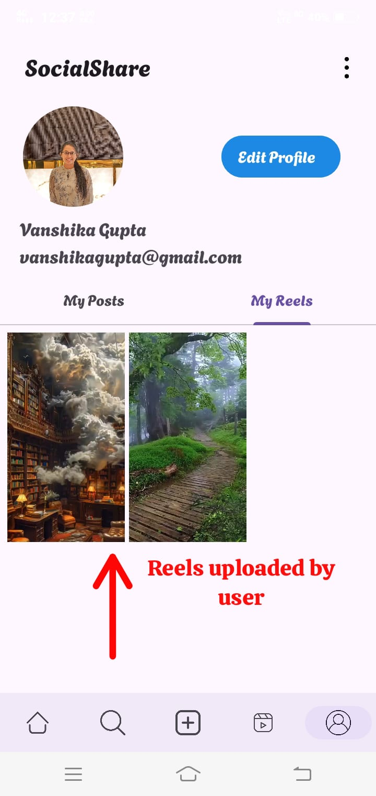  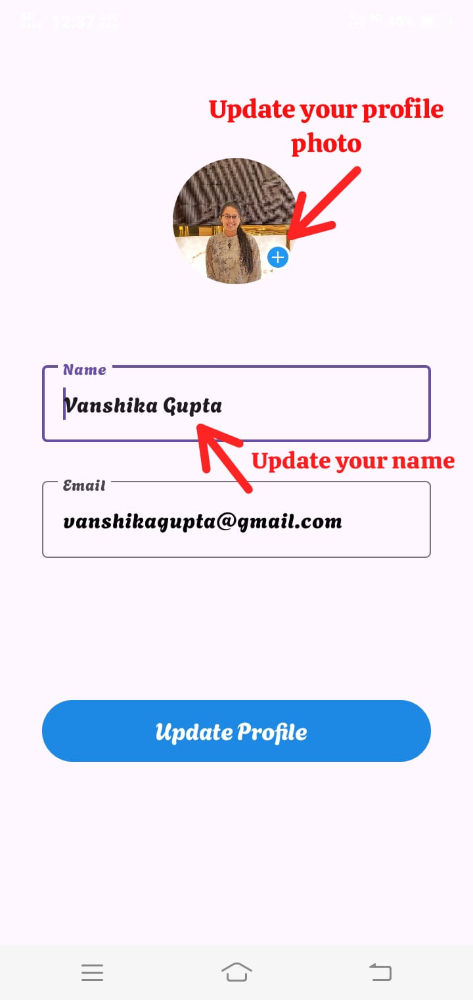  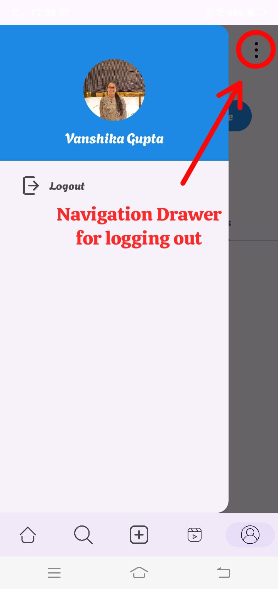

---

## 🚀 **Features**

### 🌟 **User Authentication**
- Smooth login and signup experience powered by Firebase.

### 🌟 **Post Sharing**
- Effortlessly share photos or reels with your followers.

### 🌟 **User Search**
- Discover and connect with other users seamlessly.

### 🌟 **Follow System**
- Follow or unfollow users to personalize your feed.

### 🌟 **Reels Experience**
- Watch and enjoy engaging short videos with ease.

### 🌟 **Customizable Profiles**
- Enjoy a user-friendly profile page with an edit profile option.

---

## 🛠️ **Key Technologies & Tools**

| **Category**        | **Tools/Technologies**          |  
|---------------------|---------------------------------|  
| **Language**        | Kotlin                          |  
| **Backend**         | Firebase                        |  
| **Image Handling**  | Picasso, Glide                 |  
| **UI Components**   | RecyclerView, Material3, ViewPager, CardView, Navigation Drawer, Adapter, Fragments, Intent, Bottom Navigation, Toasts|

---

## 🎯 **Upcoming Features**

1. **💬 Chat System:** Real-time messaging between users.
2. **📖 Post Stories:** Share ephemeral stories that disappear after 24 hours.
3. **❤️ Likes and Comments:** Engage with posts and reels through interactions.
4. **📊 Analytics Dashboard:** Gain insights into your account activity.

---
